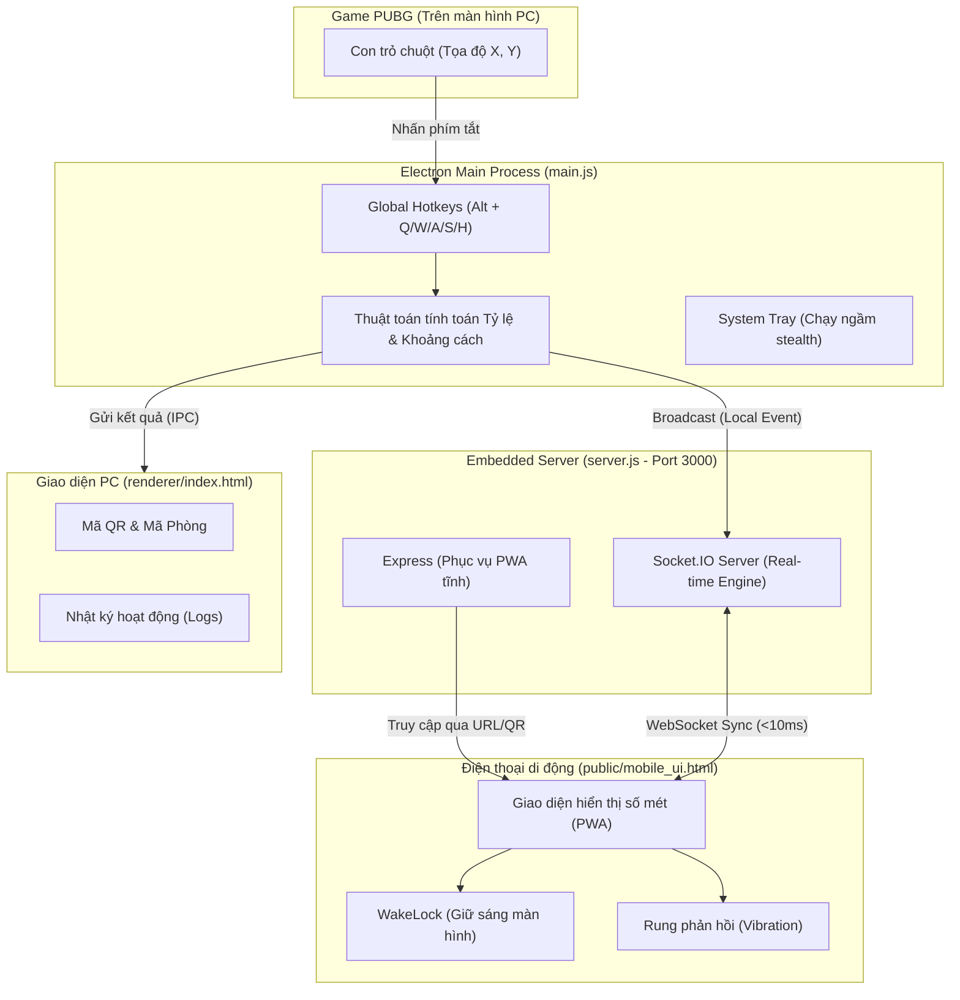
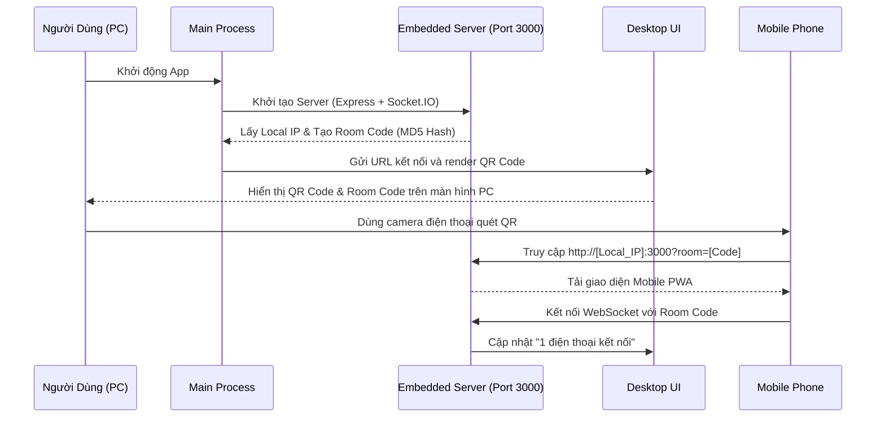

# TÀI LIỆU KIẾN TRÚC VÀ TỔNG QUAN HỆ THỐNG — GAME DISTANCE TRACKER

**Tên dự án:** Game Distance Tracker (CountMeterPUBG)  
**Phiên bản hiện tại:** v3.1.0  
**Tác giả / Phát triển:** GenHub / Owen0107  
**Mục tiêu hệ thống:** Đo khoảng cách chính xác theo thời gian thực (real-time) giữa hai điểm trên bản đồ game PUBG từ máy tính (PC) và đồng bộ hóa kết quả hiển thị lên màn hình điện thoại di động thông qua mạng nội bộ (LAN / Wi-Fi) với độ trễ gần như bằng 0 (<10ms).

---

## 1. CẤU TRÚC THƯ MỤC VÀ VAI TRÒ CỦA CÁC FILE

Hệ thống được xây dựng theo mô hình ứng dụng Desktop đa tiến trình (Electron Multi-process) kết hợp với máy chủ Web/WebSocket nhúng và giao diện Web di động (PWA - Progressive Web App).

```text
c:\SD21202\CountPUBG\
├── .gitignore              # Cấu hình bỏ qua các file tạm, log, node_modules và build output
├── README.md               # Tài liệu giới thiệu nhanh của dự án
├── package.json            # Thông tin dự án, cấu hình đóng gói (electron-builder) và danh sách thư viện
├── package-lock.json       # Bảng khóa phiên bản chính xác của các thư viện phụ thuộc
├── main.js                 # [CORE] Tiến trình chính (Main Process) của Electron
├── preload.js              # [BRIDGE] Cầu nối an toàn IPC giữa Main Process và giao diện Desktop
├── server.js               # [BACKEND] Máy chủ Express & Socket.IO chạy ngầm trong ứng dụng
├── build/                  # Thư mục chứa tài nguyên dùng để build ứng dụng (icon.png, icon.ico)
├── renderer/               # GIAO DIỆN DESKTOP (PC Frontend)
│   ├── index.html          # Giao diện chính của ứng dụng trên PC
│   └── styles.css          # Định dạng CSS giao diện phong cách Gaming Dark Mode
└── public/                 # GIAO DIỆN MOBILE (PWA Frontend)
    ├── mobile_ui.html      # Giao diện hiển thị trên điện thoại
    ├── manifest.json       # File định nghĩa ứng dụng PWA (tên, màu sắc, chế độ toàn màn hình)
    ├── sw.js               # Service Worker hỗ trợ lưu cache và chạy offline cho PWA
    └── icons/              # Bộ icon độ phân giải chuẩn (192x192, 512x512) cho di động
```

### Bảng Phân Tích Vai Trò Chi Tiết:

| Tên File / Thư Mục | Lớp Kiến Trúc | Vai Trò Chính |
| :--- | :--- | :--- |
| **`main.js`** | Core / System | Quản lý vòng đời ứng dụng, tạo giao diện `BrowserWindow`, tạo biểu tượng System Tray chạy ngầm, đăng ký tổ hợp phím tắt toàn cầu (Global Hotkeys), quản lý công thức tính toán khoảng cách và lưu cấu hình tỷ lệ bản đồ (`scale_config.json`). |
| **`server.js`** | Embedded Server | Máy chủ Express phục vụ file tĩnh giao diện PWA cho điện thoại và máy chủ WebSocket (Socket.IO) cổng `3000`. Quản lý mã phòng bảo mật (Room Code) và phát sóng dữ liệu tọa độ đến các điện thoại kết nối. |
| **`preload.js`** | IPC Security | Cầu nối `contextBridge` phơi bày API `window.electronAPI`. Đảm bảo an ninh tối đa, ngăn chặn việc truy cập trực tiếp Node.js từ mã JavaScript phía frontend. |
| **`renderer/`** | Desktop Client | Cửa sổ điều khiển trên PC hiển thị trạng thái kết nối, mã QR Code, mã Room, nhật ký hoạt động (Logs) và hướng dẫn sử dụng phím tắt. |
| **`public/`** | Mobile PWA | Giao diện hiển thị số mét cực lớn trên điện thoại. Hỗ trợ khóa sáng màn hình (`WakeLock`), rung phản hồi haptic và hiệu ứng vòng tròn năng lượng. |

---

## 2. KIẾN TRÚC HỆ THỐNG VÀ DÒNG CHẢY DỮ LIỆU (DATA FLOW)

Ứng dụng hoạt động theo mô hình **Phân tán cục bộ (Local Distributed Model)**:



### Cơ Chế Hoạt Động Liên Kết:
1. **Bắt sự kiện**: Khi người chơi di chuyển chuột trên bản đồ game PUBG và nhấn tổ hợp phím tắt (`Alt + A/S`), hệ điều hành sẽ truyền tọa độ `(X, Y)` tuyệt đối vào tiến trình `main.js`.
2. **Tính toán**: Thuật toán Pythagoras sẽ đo độ lệch pixel giữa hai điểm và nhân với tỷ lệ bản đồ `Scale (m/px)` để ra khoảng cách thực tế (đơn vị mét).
3. **Phân phối**: `main.js` gọi hàm `broadcastDistance()` của `server.js` để đẩy gói tin JSON qua đường truyền WebSocket tới tất cả các thiết bị di động đang trong phòng.

---

## 3. QUY TRÌNH NGHIỆP VỤ HOẠT ĐỘNG (BUSINESS WORKFLOWS)

### Nghiệp vụ 1: Khởi động và Thiết lập Phòng (Pairing Workflow)


### Nghiệp vụ 2: Đo Tỷ Lệ Bản Đồ Tự Động (Map Calibrating)
- **Vấn đề**: Mỗi người chơi có độ phân giải màn hình khác nhau (FullHD, 2K, 4K) và bản đồ PUBG có các mức zoom khác nhau.
- **Giải pháp**: Trên bản đồ PUBG luôn có các ô lưới vuông chuẩn xác bằng `100m x 100m`.
- **Thực thi**:
  1. Đưa chuột vào đầu góc ô lưới 100m -> Bấm `Alt + Q` (Ghi nhận điểm 1).
  2. Đưa chuột vào đuôi góc ô lưới 100m -> Bấm `Alt + W` (Ghi nhận điểm 2).
  3. Hệ thống tự động tính toán khoảng cách pixel $D_{px} = \sqrt{(x_2 - x_1)^2 + (y_2 - y_1)^2}$.
  4. Tỷ lệ bản đồ được lưu tự động: $Scale = \frac{100}{D_{px}}$ (mét/pixel) và lưu vĩnh viễn vào file `scale_config.json`.

### Nghiệp vụ 3: Đo Khoảng Cách Mục Tiêu (Distance Measurement)
1. Đưa chuột vào vị trí nhân vật của mình trên bản đồ -> Bấm `Alt + A`.
2. Đưa chuột vào điểm địch hoặc điểm cần di chuyển -> Bấm `Alt + S`.
3. Hệ thống tự tính khoảng cách, ngay lập tức hiển thị trên cửa sổ PC và làm chớp sáng/rung thiết bị di động.

---

## 4. CÁC CHỨC NĂNG NỔI BẬT VÀ ĐỘT PHÁ (STANDOUT FEATURES)

### 🚀 1. Đo Tọa Độ Siêu Tốc — Khắc Phục Hoàn Toàn Nhược Điểm Computer Vision
- Các phần mềm đo khoảng cách cũ thường dùng công nghệ nhận diện hình ảnh (OpenCV / Computer Vision) quét liên tục màn hình để tìm chấm màu. Nhược điểm là ngốn CPU/GPU (gây tụt FPS game) và rất dễ sai số khi bản đồ có mây sương mù hoặc màu tương đồng.
- **Game Distance Tracker v3.1.0** sử dụng phương pháp **tọa độ điểm trực tiếp từ con trỏ chuột**. Không tiêu tốn bất kỳ % CPU/GPU nào của game, độ chính xác tuyệt đối 100% đến từng mét và phản hồi tức thì dưới 1 mili-giây.

### 🛡️ 2. Chế Độ Ẩn Danh (Stealth & Anti-Cheat Safe)
- Tích hợp tính năng chạy ngầm sâu trong hệ thống dưới dạng **System Tray Icon**.
- Phím tắt **`Alt + H`** cho phép ẩn hoặc hiện toàn bộ giao diện PC chỉ trong tích tắc. Khi ẩn, ứng dụng biến mất hoàn toàn khỏi màn hình và thanh Taskbar, giảm thiểu tối đa rủi ro bị các phần mềm Anti-Cheat (như BattlEye / XignCode) quét nhầm là phần mềm can thiệp màn hình game.

### 📱 3. Giao Diện Mobile PWA Chuẩn Gaming Cao Cấp
- Thiết kế giao diện theo phong cách **Sci-Fi Gaming (Dark & Gold Theme)** với phông chữ `Orbitron` góc cạnh.
- **Vòng tròn năng lượng xoay liên tục (Rotating Arc)** tạo cảm giác radar định vị hiện đại.
- **Chống tắt màn hình tự động (`WakeLock API`)**: Điện thoại tự động khóa chế độ luôn sáng khi đang kết nối, người dùng không cần chạm vào màn hình để giữ sáng khi đang tập trung bắn súng.
- **Rung phản hồi (Haptic Feedback)**: Điện thoại sẽ rung lên mỗi khi có dữ liệu mới từ PC, giúp game thủ nhận biết khoảng cách đã được cập nhật mà không cần rời mắt khỏi màn hình game.
- **Lịch sử 6 lần đo gần nhất**: Hỗ trợ theo dõi chuỗi di chuyển của mục tiêu.

### 🔌 4. Zero-Config Local Server (Cắm là chạy)
- Toàn bộ máy chủ WebSocket và Web Server được nhúng trực tiếp vào tiến trình ngầm của ứng dụng Desktop. Người dùng không cần cài đặt Apache, Nginx, Node.js hay cấu hình cổng mạng phức tạp. 
- Cơ chế tạo QR code động chứa sẵn IP nội bộ và Room Code giúp việc kết nối điện thoại diễn ra tự động chỉ với 1 thao tác quét camera.
